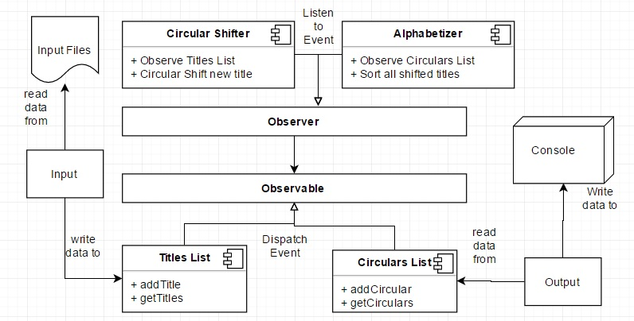

# CS3219: Assignment 1 Report
| Name | Darren Wee | Le Minh Duc |
|------|------------|-------------|
|Matric. No. | A0147609X | A0144750J |

<!-- 
1. Introduction
up to 1 paragraph about the assignment. Specify who has done which implementation
2. Requirements
Specify functional and non‐functional requirements against which you design and implement.
Refer to lecture material of first two lectures to get information on requirement specification.  
3. Architectural Design
Include a short description of the designs you have selected (or modified) to implement.
Illustrate it using one or more diagrams e.g component diagram, class diagram. Use any
diagramming notation you are familiar with.  Label your diagrams appropriately.  
4. Limitation & Benefits of Selected Designs
State limitation and benefits of the design you implemented.
5. Any other information
e.g. testing method you followed or test cases you designed or any other information  
-->

## Introduction
This assignment requires students to implement **two** architecturally different solutions to the `Key Words In Context` or `KWIC` problem.

The problem is defined as following: 

Each `input` title shall be `circularly shifted` exhaustively by removing the first word and appending it at the end of the line to create a set of circularly shifted lines.The first word (not including `words to ignore`) will be the keyword. The system shall output on the screen a listing of the circularly shifted lines for all input titles in `ascending alphabetical order`.

Our group has chosen to implement two solutions as following with each member of the group implementing one solution:
- Darren Wee *(A0147609X)*: `Pipe-and-Filter`
- Le Minh Duc *(A0144750J)*: `Implicit Invocation`

## Requirements
### Functional Requirements
- Each title must be circularly shifted exhaustively 
- A word cannot be a keyword if that word is also a `word to ignore`
- Any changes in the input must always result in an alphabetically ascendingly sorted output

### Non-functional Requirements
- User friendly ‐  the system user interface should be easy for users to use the system
- Response time ‐  the system should respond to user's query in a reasonable time e.g. comparable to the common search engine such as Yahoo.
- Extendable  ‐  new functions can be added to the system easily without any major changes to the design of the system.

## Architectural Design
### Implicit Invocation
`Implicit invocation` or `event-driven` architecture is chosen as one of the two approaches for this software.

Traditionally in this architecture, procedures are not called explicitly by other procedures. Instead, some procedures **dispatch** events, which are **listened** to and **handled** by other procedures.

In this implementation, we use Java `Observable` class and `Observer` interface to achieve event dispatching and receving functionalities.

The essential architecture of the software is explained in the following diagram:

 

In this design, we have two **event dispatchers**:
1. List of all original titles (input)
2. List of all circularly-shifted titles (output)

And two **event handlers**
1. Circular Shifter
2. Alphabetizer

The general flow of data is as following:
- Data read from `files` by `Input` component
- Titles are copied to`Titles List`
- `Titles List` dispatches an event
- `CircularShifter` handles `Titles List`'s event by shifting according to the KWIC principle
- `CircularShifter` writes newly shifted lines to `Circulars List`
- `Circular List` dispatches an event
- `Alphabetizer` handles `Circular List`'s event by sorting all shifted titles in alphabetical order
- Data are printed out on demand by `Output` component
#### Limitations
- The order of invocations are not always clear or intuitive. In this implementation, the act of reading in the input, for example, causes the whole chain of events to run until the program is finished. This is undesirable in some situations, particuarly in this case, the Ignore List must be read first because otherwise it will be empty until the program is already over.
- More space is neeed for `Event` classes, registering `dispatchers` and `handlers`.
- Strictly speaking, shared data should only be transferred as part of the `Event` ojbect. This is not always convenient. In this particular implementation, shared data were extracted from the source `Observable` object for convenience but this limits the extensibility of the software.
#### Benefits
- It is easy to add on new functions which make use of the same data due to the ease of registering handlers and dispatchers.
- Highly customizable because `Event` classes can be made into complex Objects with useful fields and methods.
- Reduce unecessry dependencies/coupling because components deal directly with the ones they are supposed to handle.
### Pipe-and-Filter Architecture
#### Limitations
#### Benefits

## Testing
### Le Minh Duc - A0144750J
For this implementation, I chose to do unit testing for CircularShifter and integrated testing right after that due to the relatively small and simple scale of each component.

***Unit testing for CircularShifter***

| Title | Expected Result| Remarks |
|------|------------|-------------|
|is is is is | nothing | all ignored words |
|is a of the| nothing| all ingored words|
|Sailor Moon Goes Crazt| All 4 permutations| All keywords|
|Game of Thrones| 2 out of 3 permutations|mixture of keywords and ignored words|
|areallylongtitlewithoutspace| exact input| one word title|
|[empty line]| nothing| ingore empty input|

***Integrated testing for CircularShifter & Alphabetizer***
| Title | Expected Result| Remarks |
|------|------------|-------------|
|All CAPS| corectly sorted alphabetically| |
|All lower-case| corectly sorted alphabetically||
|Mixed CAPS and lower-case| correctly sorted ignored case||
|Some words are numbers| correctly sorted number first| ASCII order|
|Some words are symnol| correctly sorted by ASCII order||
